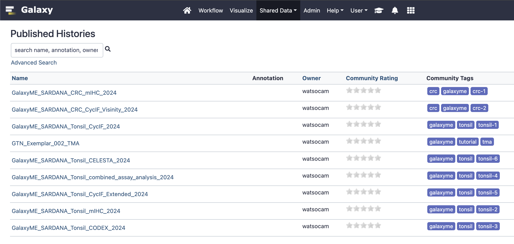

# Galaxy tools for Multiplex Tissue Image Analysis

This repo contains a subset of Galaxy repositories from the the Tool Shed [https://toolshed.g2.bx.psu.edu/](https://toolshed.g2.bx.psu.edu/) designed for multiplex tissue imaging (MTI) analysis. These tools and their associated workflows, example histories, and usage are described in the pre-print manuscript "**Galaxy-ME: A web-based software resource for interactive analysis of multiplex tissue imaging datasets**" which can currently be found on bioRxiv:

https://www.biorxiv.org/content/10.1101/2022.08.18.504436v2 

If you use the tools in this repository, please cite the pre-print above.

The remainder of this readme serves as a supplemental resource for the manuscript and contains useful links for those interested in using this tool suite. 

---

### Table of Contents

1. [Overview of Galaxy-ME histories](#overview)
2. [Manuscript history ID table](#manuscript)
3. [Galaxy-ME Tutorials](#tutorials)
4. [Primary Data Access](#data)

---

# Overview of Galaxy-ME Histories 

Each dataset analyzed in this study has an analysis history on [cancer.usegalaxy.org](https://cancer.usegalaxy.org/) under the [published histories tab](https://cancer.usegalaxy.org/histories/list_published). The Galaxy histories contain the images which can be viewed using Avivator or Vitessce, all analysis steps, parameters used, and additional files (marker files, phenotype workflows, GMM threshold plots, etc.). The histories can be imported into a user's own personal history to re-run the analysis or run additional GalaxyME tools on the datasets. 

# Manuscript history ID Table 

| History Manuscript ID | History Name |
|:--------------|:------------- |
| Tonsil 1      | GalaxyME_SARDANA_Tonsil_CycIF_2024 | 
| Tonsil 2      | GalaxyME_SARDANA_Tonsil_mIHC_2024  | 
| Tonsil 3      | GalaxyME_SARDANA_Tonsil_CODEX_2024 | 
| Tonsil 4      | GalaxyME_SARDANA_Tonsil_combined_assay_analysis_2024 | 
| Tonsil 5      | GalaxyME_SARDANA_Tonsil_CycIF_Extended_2024 | 
| Tonsil 6      | GalaxyME_SARDANA_Tonsil_CELESTA_2024 |
| CRC 1         | GalaxyME_SARDANA_CRC_mIHC_2024 | 
| CRC 2         | GalaxyME_SARDANA_CRC_CycIF_Visinity_2024 | 

This table provides a shorthand ID so that histories can be referenced in the manuscript methods 

# Galaxy and Galaxy-ME tutorials 

For a general introduction to navigating and performing analyses in Galaxy, see the [Galaxy Training Network's Introductory Tutorials](https://training.galaxyproject.org/training-material/topics/introduction/) [[1](#ref-1),[2](#ref-2)].

For an example and tutorial of a Galaxy-ME workflow, see [End-to-End Tissue Microarray Image Analysis with Galaxy-ME](https://training.galaxyproject.org/training-material/topics/imaging/tutorials/multiplex-tissue-imaging-TMA/tutorial.html)

# Primary Data Access 

All of the original files and information about the analyses conducted for the MCMICRO study can be found in [this Synapse folder](https://www.synapse.org/#!Synapse:syn24849819/wiki/608441).

The SARDANA CRC data analyzed in this study can be found in [this Synapse folder](https://www.synapse.org/#!Synapse:syn47164089).

# References 

1.  Saskia Hiltemann, Nicola Soranzo, Clemens Blank, Anton Nekrutenko, Björn Grüning, Anne Pajon, Helena Rasche, 2022 Galaxy 101 (Galaxy Training
   Materials).https://training.galaxyproject.org/training-material/topics/introduction/tutorials/galaxy-intro-101/tutorial.html Online; accessed Fri Jul 08 2022
2.   Batut et al., 2018 Community-Driven Data Analysis Training for Biology Cell Systems 10.1016/j.cels.2018.05.012

